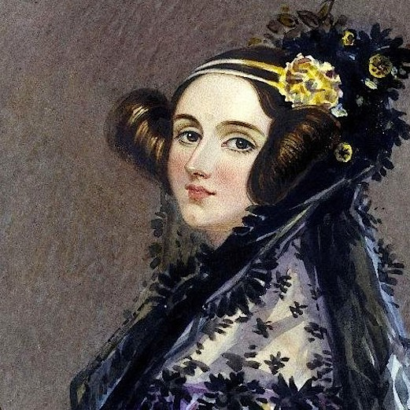

# ADA LOVELACE

The first programmer! English mathematician and writer, child of Lord Byron. She worked next to Charles Babbage (The father of programming) and she was the first to recognise that a computing machine can not only calculate but can also execute algorithms. She described herself as an "Analyst & Metaphysician. She died of uterine cancer at the age of 36.