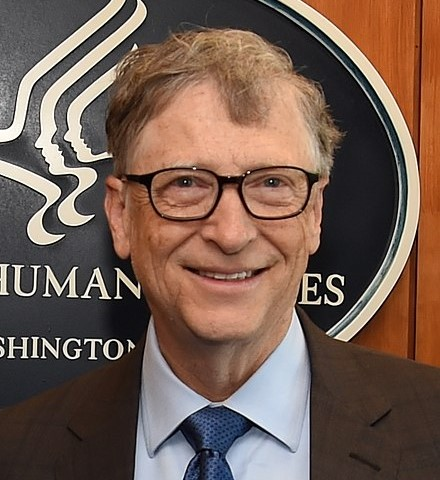

# Bill Gates

William Henry Gates is an American business magnate, investor, author, philanthropist, and humanitarian. He is best known as the principal founder of Microsoft Corporation. Gates is one of the best-known entrepreneurs of the personal computer revolution.

He studied at Harvard University after scoring 1590/1600 at SAT. In his second year, Gates devised an algorithm for pancake sorting as a solution to one of a series of unsolved problems presented in a combinatorics class by Harry Lewis, one of his professors. Gates' solution held the record as the fastest version for over thirty years. His solution was later formalized in a published paper in collaboration with Harvard computer scientist Christos Papadimitriou. On November 1975, he found Microsoft and never returned to Harvard to complete his studies.

