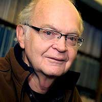

# DONALD KNUTH

American Computer Scientist, mathematician and professor at Stanford University. He is the creator of the TeX computer typesetting system. He has been called the father of the analysis of algorithms. In his freshman year, Knuth focused of physics but his professor persuaded him to switch to mathematics, in which he scored the highest grade of his class (skipping it for the rest of the year). Knuth stays traditional, as he sends check-like certificates and 2.56$ to people who find technical, typographical or historical errors on his publications. Knuth reward check is considered by MIT Technology Review as "among computerdom's most prized trophies". 