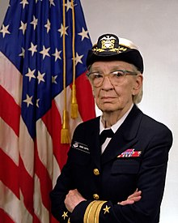

# GRACE HOOPER

### The programming languages inventor

Grace Hooper also known as "Amazing Grace" was an American computer scientist, United Stated Navy admiral and a pioneer of computer programming. She always dreamed of a programming language written in English, so she developed COBOL, an early high-level programming language. ENIAC programming team hired her and brought her to work with them. She was credited with coining the terms "bug" and "de-bug" when she found a moth into her log book. 