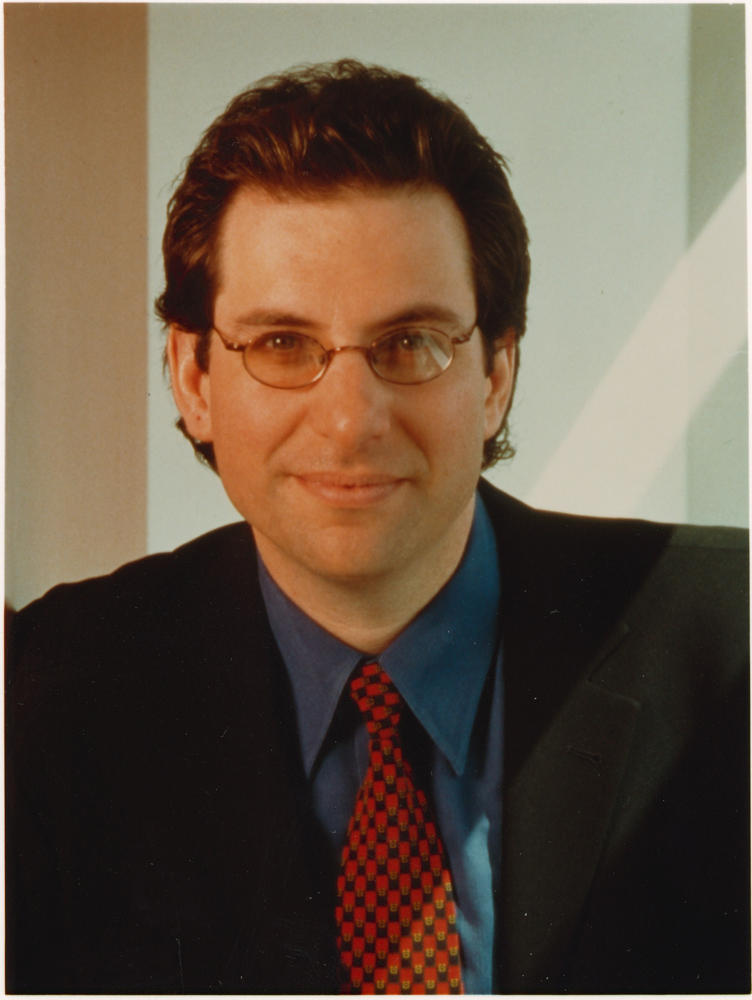

# KEVIN MITNICK

Supporters vote for his release
American computer security consultant, author, social engineer and hacker best know for his arrest on 1997 and five years later for various computer and communications-related crimes. 
* Hacked Motorola, NEC, Nokia, Jujitsu Siemens, Apple and FBI
* Rumors have it that he was able to activate nuclear weapons with a whistle on a phone
* Since 2000, Mitnick has been a paid security consultant, public speaker and author.
