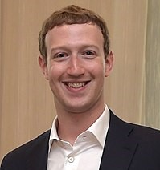

# Mark Zuckerberg

Mark Elliot Zuckerberg is an American technology entrepreneur and philanthropist. When Zuckerberg was 12, he created an instant messaging program that he called ZuckNet so his dentist father could know when patients arrived. Some years later he attended Harvard University, where he launched Facebook from his dormitory room on February 4, 2004. Now he has a net work of 62.3 billion dollars. Many big name companies tried to redeem it( MySpace, Yahoo, NBC, Microsoft and Google) but Zuckerberg denied.