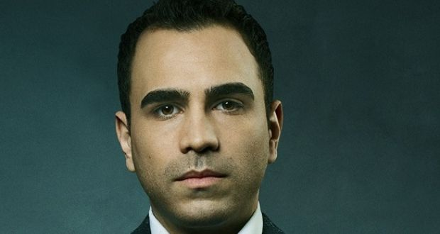

# KEVIN MITNICK

Known as MafiaBoy, a security expert from Quebec - Canada, who launched a series of highly publicized DDoS against 
* Yahoo 
* Fifaa.com
* Amazon.com
* Dell 
* eBay
* CNN
According to him: "There was something intoxicating about the idea of dictating everything the computer did, down to the smallest of functions". On 2000, he targeted Yahoo with a project named Rivolta, meaning "riot" and managed to shut it down. After that, many multibillion dollar companies drought down via DDos. And he did all that when he was 15 years old!