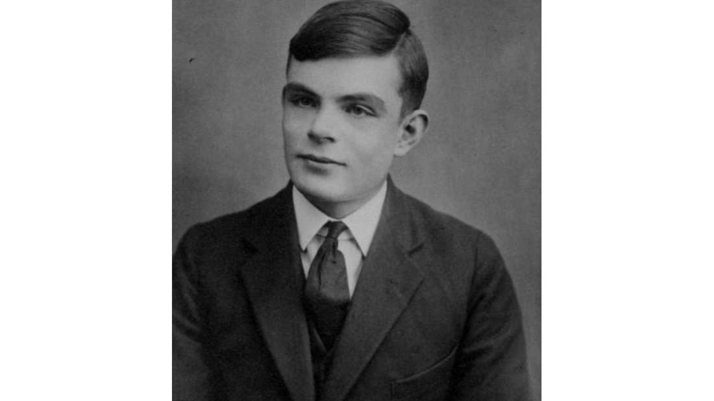

# Alan Turing

English mathematician, computer scientist, logician, cryptanalyst, philosopher and theoritical biologist. Father of theoritical computer science and AI. 
* Created BOMBE in order to crack Enigma and defeat the Nazis in WW2. 
* Also known for Turing machine, a usefull way to evaluate Artificial Intelligence.
* Created the first computer chess program.

He was prosecuted for being gay and opted to undergo chemical castration instead of serving time in jail.  